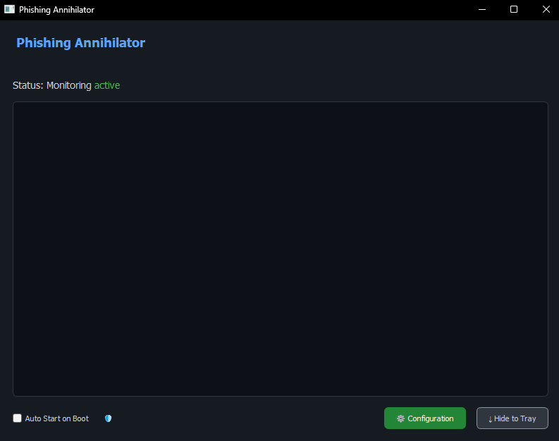
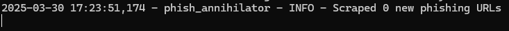

# Phishing Kit Annihilator 🔥🛡️


*Cyberpunk-themed monitoring interface with threat visualization*

## Features

- **Real-time Detection**  
    
  *Visual and audio alerts for phishing attempts*

- Advanced domain analysis (homoglyphs, typosquatting)
- Brand logo recognition
- 3D threat globe visualization
- Cross-platform support (Windows/Mac/Linux)

## 🚀 Installation

```bash
# Clone repository
git clone https://github.com/yourusername/phishing-annihilator.git
cd phishing-annihilator

# Install dependencies
pip install -r requirements.txt
```

## ⚙️ Configuration

Edit `config.yaml`:
```yaml
# API Keys
phishtank_api_key: "your_key"
virustotal_api_key: "your_key"

# UI Settings
ui:
  theme: "cyberpunk"  # or "dark", "light"
  alert_sound: true
```

## 🖥️ Usage Guide

### Basic Usage
```bash
python main.py
```

### Key Features
1. **Dashboard** - Real-time threat monitoring
2. **Globe View** - Interactive 3D visualization
3. **Alert History** - Detailed threat log

### Detection Example
```python
from phish_annihilator import detect_phishing

result = detect_phishing("faceb00k-login.com")
print(result)  # {'score': 0.92, 'reason': 'Homoglyph detected'}
```

## 📸 Screenshots

| Threat Dashboard | Alert Notification |
|------------------|--------------------|
|  |  |

## 🤝 Contributing

1. Fork the project
2. Create your feature branch (`git checkout -b feature/AmazingFeature`)
3. Commit your changes (`git commit -m 'Add some AmazingFeature'`)
4. Push to the branch (`git push origin feature/AmazingFeature`)
5. Open a Pull Request

## 📜 License

Distributed under the MIT License. See `LICENSE` for more information.
